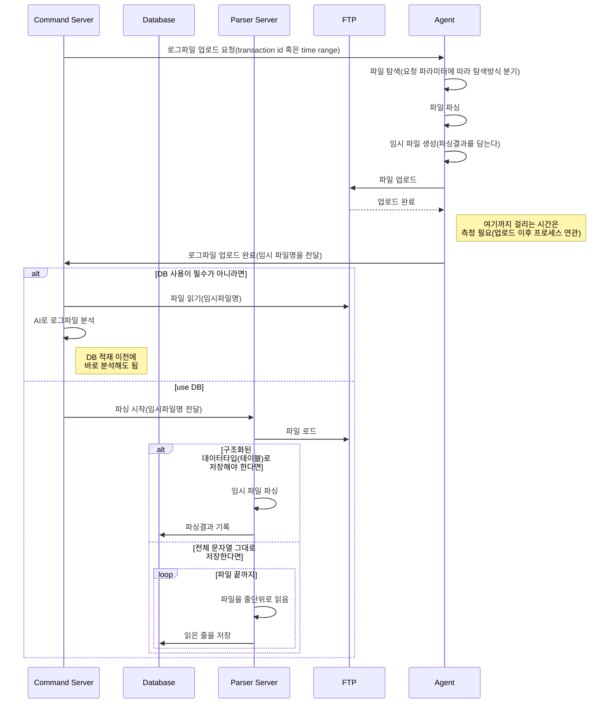
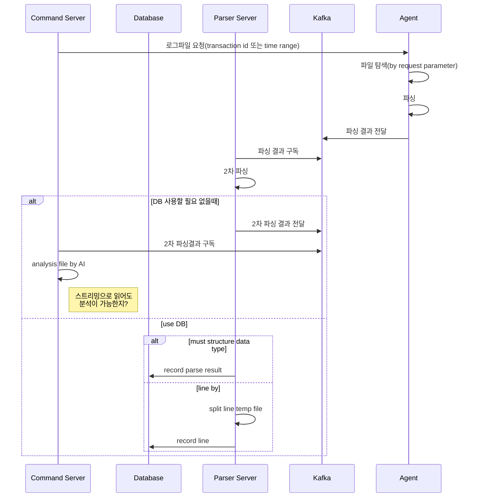

# Agent Architecture-0.1

# Pre-condition

- DB는 파싱결과에 대해서 라인단위 또는 하나의 큰 BLOB 형태로 저장할수 있음(오세영님 의견)
    - 파싱결과로 어떤 데이터가 필요한지는 좀더 정교화할 필요가 있음

# Option 1

```mermaid
sequenceDiagram
	participant cs as Command Server
	participant db as Database
	participant ps as Parser Server
	participant ftp as FTP
	participant ag as Agent
	
	cs->>ag: 로그파일 업로드 요청(transaction id 혹은 time range)
	ag->>ag: 파일 탐색(요청 파라미터에 따라 탐색방식 분기)
	ag->>ag: 파일 파싱
	ag->>ag: 임시 파일 생성(파싱결과를 담는다)
	ag->>ftp: 파일 업로드
	ftp-->>ag: 업로드 완료
	Note right of ag: 여기까지 걸리는 시간은<br>측정 필요(업로드 이후 프로세스 연관)
	ag->>cs: 로그파일 업로드 완료(임시 파일명을 전달)
	
  alt DB 사용이 필수가 아니라면
  cs->>ftp: 파일 읽기(임시파일명)
  cs->>cs: AI로 로그파일 분석
  Note right of cs:DB 적재 이전에<br>바로 분석해도 됨
  else use DB
		cs->>ps: 파싱 시작(임시파일명 전달)
		ps->>ftp: 파일 로드
	  alt 구조화된 데이터타입(테이블)로 저장해야 한다면		
			ps->>ps: 임시 파일 파싱
			ps->>db: 파싱결과 기록
		else 전체 문자열 그대로 저장한다면
			loop 파일 끝까지
			  ps->>ps: 파일을 줄단위로 읽음
				ps->>db: 읽은 줄을 저장
			end
		end
	end	
	
	
```

# Option 2

```mermaid
sequenceDiagram
	participant cs as Command Server
	participant db as Database
	participant ps as Parser Server
	participant k as Kafka
	participant ag as Agent
	
	cs->>ag: 로그파일 요청(transaction id 또는 time range)
	ag->>ag: 파일 탐색(by request parameter)
	ag->>ag: 파싱
	ag->>k: 파싱 결과 전달
  ps->>k: 파싱 결과 구독
  ps->>ps: 2차 파싱
	
  alt DB 사용할 필요 없을때
	  ps->>k: 2차 파싱 결과 전달
	  cs->>k: 2차 파싱결과 구독
	  cs->>cs: analysis file by AI
	  Note right of cs: 스트리밍으로 읽어도<br/>분석이 가능한지?
  else use DB
	  alt must structure data type		
			ps->>db: record parse result
		else line by
		  ps->>ps: split line temp file
			ps->>db: record line
		end
	end	
	
	
```